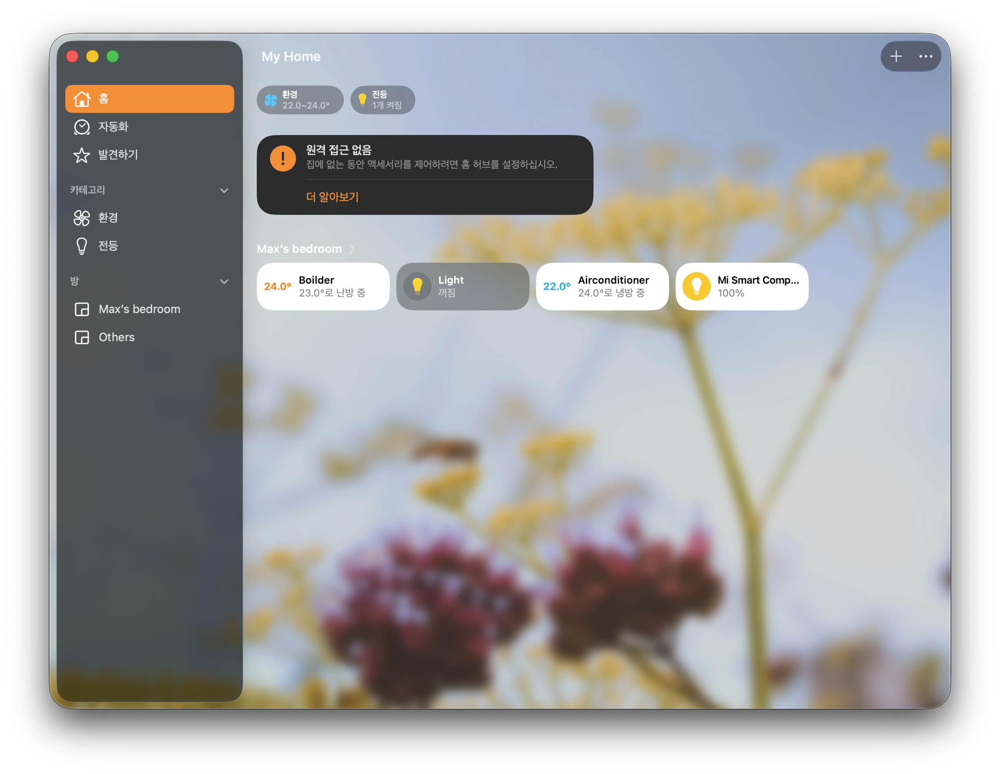

# homebridge-smartprugio
푸르지오 스마트홈 비공식 API로 보일러/전등을 Homebridge(HomeKit)에서 제어하는 플러그인

푸르지오 스마트홈(비공식 API)과 Homebridge를 연동해 보일러(난방)와 전등을 HomeKit에서 제어하는 플러그인입니다.

클리앙 글(https://www.clien.net/service/board/cm_iot/15914856)를 참고하여 개발했습니다.

> ⚠️ 비공식 API를 사용합니다. 제조사 정책/서버 변경에 따라 동작이 중단될 수 있습니다.
> 
> ⚠️ 스마트홈 앱에서 추출한 비공식 API 및 토큰을 사용합니다. 해당 사용에 따른 책임과 모든 위험(계정 제한/차단, 서비스 장애 등)은 사용자에게 있습니다.
> 
> ⚠️ 제조사의 요청이 있을 경우 본 저장소는 비공개로 전환되거나 삭제될 수 있습니다.

## 특징

- **전등(LIGHTS)**: 전원 ON/OFF 제어
- **보일러(HEATING)**: 전원 ON/OFF + 목표온도(HTEMPERATURE) 설정
- **안정성**: 요청 폭주 방지를 위한 디바운스 + 주기적 폴링
- **UI 안정화**: HomeKit 표시값 캐시 및 강제 동기화

## 동작 개요

- 사용자 token, auth 및 추가 API는 사용자가 직접 추가하여 `index.js`에 반영해야 합니다.
- `https://svc.smartprugio.com:18888` 비공식 Endpoint API를 사용합니다.
- `ctl_tp_cd=LIGHTS` / `ctl_tp_cd=HEATING`으로 기기 상태 조회 및 제어를 수행합니다.
- 보일러는 난방을 위한 장치임으로 홈킷 앱 내 **냉방/자동 모드 미지원**이며, HomeKit에서 해당 상태 선택 시 **HEAT로 강제**됩니다.

## 설치

1. Homebridge를 먼저 설치합니다.

```bash
sudo npm install -g --unsafe-perm homebridge homebridge-config-ui-x
sudo hb-service install
```

2. 플러그인을 설치합니다.

```bash
npm install homebridge-smartprugio
```

Homebridge 설치 후 `~/.homebridge` 내 설정을 수정해야 합니다.
- `~/.homebridge/config.json`에 액세서리 설정 추가
- `~/.homebridge/index.js`에 플러그인 로드/등록 반영


## 설정

사용 전에 **본인의 푸르지오 계정으로 `auth`/`token`을 직접 추출**해야 합니다.
`~/.homebridge/config.json`의 `accessories`에 `token`/`auth` 값을 채워 넣어야 정상 동작합니다.
`~/.homebridge/config.json`의 `accessories`에 아래와 같이 추가합니다.

### 전등 예시

```json
{
  "accessory": "SmartPrugioLight",
  "name": "거실 전등",
  "deviceId": "Lt03_pow01",
  "token": "YOUR_TOKEN",
  "auth": "YOUR_BASIC_AUTH",
  "pollIntervalSec": 10,
  "minControlIntervalMs": 600
}
```

### 보일러(난방) 예시

```json
{
  "accessory": "SmartPrugioThermostat",
  "name": "거실 보일러",
  "deviceId": "Ht03",
  "token": "YOUR_TOKEN",
  "auth": "YOUR_BASIC_AUTH",
  "pollIntervalSec": 10,
  "minControlIntervalMs": 600
}
```

## 옵션 설명

- `deviceId` (필수): 푸르지오 기기 ID
  - 전등 예: `Lt03_pow01`
  - 보일러 예: `Ht03`
- `token` (필수): API 토큰 (헤더 `token`)
- `auth` (필수): Basic 인증 문자열 (헤더 `Authorization`)
- `pollIntervalSec` (기본 10): 상태 폴링 주기(초). `0`이면 폴링 비활성화
- `minControlIntervalMs` (기본 600): 제어 요청 디바운스(밀리초)
- `baseUrl` (기본 `https://svc.smartprugio.com:18888`): API 베이스 URL
- `appVersion` (기본 `1.7.0-v84`): 요청 헤더에 포함되는 앱 버전
- `userAgent` (기본 `Smart Home/24`): 요청 헤더에 포함되는 User-Agent

> `token`/`auth`는 환경변수로도 설정 가능합니다:  
> `SMARTPRUGIO_TOKEN`, `SMARTPRUGIO_AUTH`

## 사용 예시



## 제약 사항

- 보일러는 **난방만 지원**합니다. HomeKit의 냉방/자동 선택은 HEAT로 강제됩니다.
- 보일러 제어는 `POWER` 및 `HTEMPERATURE`만 사용하며, 모드 관련 제어는 없습니다.
- 비공식 API 사용으로 인해 **장기적인 안정성 보장 불가**합니다.

## 개발 메모

- 전등: `device_attr_cd=POWER`에 `ON/OFF` 전송
- 보일러: `POWER`, `HTEMPERATURE`, `CTEMPERATURE`를 사용
- 제어 후 짧은 딜레이 뒤 상태를 재조회하여 UI를 동기화합니다.

## 라이선스

MIT
