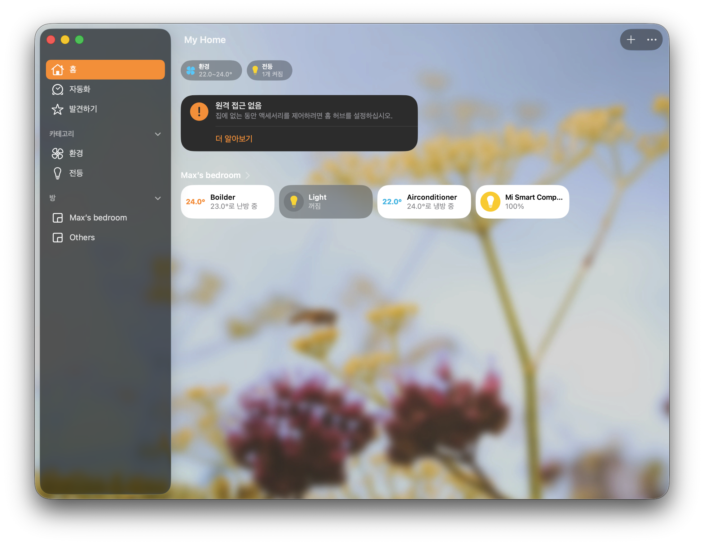

# homebridge-smartprugio
푸르지오 스마트홈 비공식 API로 보일러/전등/에어컨을 Homebridge(HomeKit)에서 제어하는 플러그인

푸르지오 스마트홈(비공식 API)과 Homebridge를 연동해 보일러(난방), 전등, 에어컨(냉방)을 HomeKit에서 제어하는 플러그인입니다.

클리앙 글(https://www.clien.net/service/board/cm_iot/15914856)를 참고하여 개발했습니다.

> ⚠️ 비공식 API를 사용합니다. 제조사 정책/서버 변경에 따라 동작이 중단될 수 있습니다.
> 
> ⚠️ 스마트홈 앱에서 추출한 비공식 API 및 토큰을 사용합니다. 해당 사용에 따른 책임과 모든 위험(계정 제한/차단, 서비스 장애 등)은 사용자에게 있습니다.
> 
> ⚠️ 제조사의 요청이 있을 경우 본 저장소는 비공개로 전환되거나 삭제될 수 있습니다.

## 특징

- **전등(LIGHTS)**: 전원 ON/OFF 제어
- **보일러(HEATING)**: 전원 ON/OFF + 목표온도(HTEMPERATURE) 설정
- **에어컨(AIRCON)**: 전원 ON/OFF + 목표온도(HTEMPERATURE) 설정
- **안정성**: 요청 폭주 방지를 위한 디바운스 + 주기적 폴링
- **UI 안정화**: HomeKit 표시값 캐시 및 강제 동기화

## 동작 개요

- 사용자 token, auth 및 추가 API는 사용자가 직접 추가하여 `index.js`에 반영해야 합니다.
- `https://svc.smartprugio.com:18888` 비공식 Endpoint API를 사용합니다.
- `ctl_tp_cd=LIGHTS` / `ctl_tp_cd=HEATING` / `ctl_tp_cd=AIRCON`으로 기기 상태 조회 및 제어를 수행합니다.
- 보일러는 난방을 위한 장치임으로 홈킷 앱 내 **냉방/자동 모드 미지원**이며, HomeKit에서 해당 상태 선택 시 **HEAT로 강제**됩니다.
- 에어컨은 냉방 장치임으로 홈킷 앱 내 **난방/자동 모드 미지원**이며, HomeKit에서 해당 상태 선택 시 **COOL로 강제**됩니다.

## 설치

1. Homebridge를 먼저 설치합니다.

```bash
sudo npm install -g --unsafe-perm homebridge homebridge-config-ui-x
sudo hb-service install
```

2. 플러그인을 설치합니다.

```bash
npm install homebridge-smartprugio
```

> 참고: 현재 npm 레지스트리에 패키지가 없거나 private 상태면 위 명령이 실패할 수 있습니다.  
> 이 경우 아래 "Git 폴더에서 설치" 방법을 사용하세요.

### Git 폴더에서 설치(권장)

저장소를 클론한 뒤, 해당 폴더를 전역 설치하면 됩니다.

```bash
git clone <YOUR_REPO_URL> homebridge-smartprugio
cd homebridge-smartprugio
npm install
npm install -g .
```

이미 클론된 폴더가 있다면:

```bash
cd /path/to/homebridge-smartprugio
npm install
npm install -g .
```

### 재설치 / 업데이트

코드 수정 후 반영할 때는 아래 순서로 진행합니다.

```bash
cd /path/to/homebridge-smartprugio
npm install
npm uninstall -g homebridge-smartprugio
npm install -g .
sudo hb-service restart
```

> `hb-service`를 쓰지 않고 수동 실행 중이면, 기존 Homebridge 프로세스를 종료 후 다시 실행하세요.
>  
> ```bash
> pkill -f "^homebridge$"
> homebridge -I -U ~/.homebridge
> ```

Homebridge 설치 후 `~/.homebridge` 내 설정을 수정해야 합니다.
- `~/.homebridge/config.json`에 액세서리 설정 추가
- `~/.homebridge/index.js`에 플러그인 로드/등록 반영


## 설정

사용 전에 **본인의 푸르지오 계정으로 `auth`/`token`을 직접 추출**해야 합니다.
`token`/`auth`는 액세서리별로 넣을 수도 있고, 환경변수로 공통 설정할 수도 있습니다.
단건 액세서리 방식(`accessories`) 또는 다중 일괄 방식(`platforms > SmartPrugioPlatform`) 중 하나를 선택해 사용할 수 있습니다.
`~/.homebridge/config.json`의 `accessories`에 아래와 같이 추가합니다.

### 전등 예시

```json
{
  "accessory": "SmartPrugioLight",
  "name": "거실 전등",
  "deviceId": "Lt03_pow01",
  "token": "YOUR_TOKEN",
  "auth": "YOUR_BASIC_AUTH",
  "pollIntervalSec": 10,
  "minControlIntervalMs": 600
}
```

### 다중 일괄 등록(Platform) 예시

한 번의 플랫폼 블록으로 여러 기기를 등록할 수 있습니다.

```json
{
  "platform": "SmartPrugioPlatform",
  "name": "Prugio Devices",
  "token": "YOUR_TOKEN",
  "auth": "YOUR_BASIC_AUTH",
  "pollIntervalSec": 10,
  "minControlIntervalMs": 600,
  "devices": [
    {
      "accessory": "SmartPrugioLight",
      "name": "거실 전등",
      "deviceId": "Lt03_pow01"
    },
    {
      "accessory": "SmartPrugioThermostat",
      "name": "거실 보일러",
      "deviceId": "Ht03"
    },
    {
      "accessory": "SmartPrugioAirConditioner",
      "name": "방3 에어컨",
      "deviceId": "Ac03"
    }
  ]
}
```

> `devices[].accessory`는 `SmartPrugioLight`, `SmartPrugioThermostat`, `SmartPrugioAirConditioner`를 권장합니다.  
> 하위 호환으로 `SmartPrugioAircon`도 인식합니다.

### 보일러(난방) 예시

```json
{
  "accessory": "SmartPrugioThermostat",
  "name": "거실 보일러",
  "deviceId": "Ht03",
  "token": "YOUR_TOKEN",
  "auth": "YOUR_BASIC_AUTH",
  "pollIntervalSec": 10,
  "minControlIntervalMs": 600
}
```

### 에어컨(냉방) 예시

```json
{
  "accessory": "SmartPrugioAirConditioner",
  "name": "방3 에어컨",
  "deviceId": "Ac03",
  "token": "YOUR_TOKEN",
  "auth": "YOUR_BASIC_AUTH",
  "pollIntervalSec": 10,
  "minControlIntervalMs": 600
}
```

## 옵션 설명

- `deviceId` (필수): 푸르지오 기기 ID
  - 전등 예: `Lt03_pow01`
  - 보일러 예: `Ht03`
  - 에어컨 예: `Ac03`
- `token` (필수): API 토큰 (헤더 `token`)
- `auth` (필수): Basic 인증 문자열 (헤더 `Authorization`)
- `pollIntervalSec` (기본 10): 상태 폴링 주기(초). `0`이면 폴링 비활성화
- `minControlIntervalMs` (기본 600): 제어 요청 디바운스(밀리초)
- `cacheMaxAgeMs` (기본 900): 캐시를 신선하다고 보는 최대 시간(밀리초). 초과 시 백그라운드 재조회
- `controlSyncWindowMs` (기본 2200): 제어 직후 서버 지연값으로 UI가 되돌아가지 않도록 보호하는 시간(밀리초)
- `baseUrl` (기본 `https://svc.smartprugio.com:18888`): API 베이스 URL
- `appVersion` (기본 `1.7.0-v84`): 요청 헤더에 포함되는 앱 버전
- `userAgent` (기본 `Smart Home/24`): 요청 헤더에 포함되는 User-Agent

> `token`/`auth`는 환경변수로도 설정 가능합니다:  
> `SMARTPRUGIO_TOKEN`, `SMARTPRUGIO_AUTH`

## 환경변수 설정

### 1) 터미널(zsh) 공통 설정

`~/.zshrc`에 아래를 추가:

```bash
export SMARTPRUGIO_TOKEN="YOUR_TOKEN"
export SMARTPRUGIO_AUTH="YOUR_BASIC_AUTH"
```

적용:

```bash
source ~/.zshrc
```

### 2) Homebridge 서비스(hb-service) 공통 설정

`hb-service`로 실행 중이면, 아래 파일에 넣으면 서비스 시작 시 자동 반영됩니다.

파일: `~/.homebridge/.uix-hb-service-homebridge-startup.json`

```json
{
  "env": {
    "SMARTPRUGIO_TOKEN": "YOUR_TOKEN",
    "SMARTPRUGIO_AUTH": "YOUR_BASIC_AUTH"
  }
}
```

반영을 위해 Homebridge 서비스 재시작:

```bash
sudo hb-service restart
```

> macOS에서는 `hb-service restart`에 `sudo`가 필요합니다.

### 3) config.json에서 token/auth 제거(환경변수 사용 시)

환경변수 공통 설정을 사용할 경우, 각 액세서리/디바이스의 `token`, `auth`는 생략해도 됩니다.

## 추천 운영 구성

실사용에서는 아래 조합을 권장합니다.

1. 플러그인 설치: `npm install -g .` (Git 폴더 내)
2. 토큰 설정: 환경변수(`SMARTPRUGIO_TOKEN`, `SMARTPRUGIO_AUTH`)
3. 기기 등록: `platforms`의 `SmartPrugioPlatform` + `devices[]` 배열

## 사용 예시



## 제약 사항

- 보일러는 **난방만 지원**합니다. HomeKit의 냉방/자동 선택은 HEAT로 강제됩니다.
- 보일러 제어는 `POWER` 및 `HTEMPERATURE`만 사용하며, 모드 관련 제어는 없습니다.
- 에어컨은 **냉방만 지원**합니다. HomeKit의 난방/자동 선택은 COOL로 강제됩니다.
- 에어컨 목표온도는 API 응답 기준 `18~30` 범위로 제한됩니다.
- 비공식 API 사용으로 인해 **장기적인 안정성 보장 불가**합니다.

## 개발 메모

- 전등: `device_attr_cd=POWER`에 `ON/OFF` 전송
- 보일러: `POWER`, `HTEMPERATURE`, `CTEMPERATURE`를 사용
- 에어컨: `POWER`, `HTEMPERATURE`, `CTEMPERATURE`를 사용
- 제어 후 짧은 딜레이 뒤 상태를 재조회하여 UI를 동기화합니다.

## 라이선스

MIT
